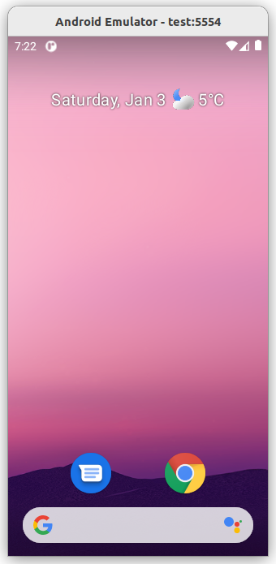
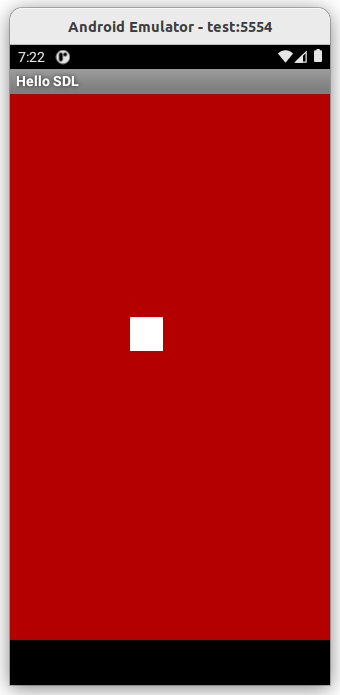
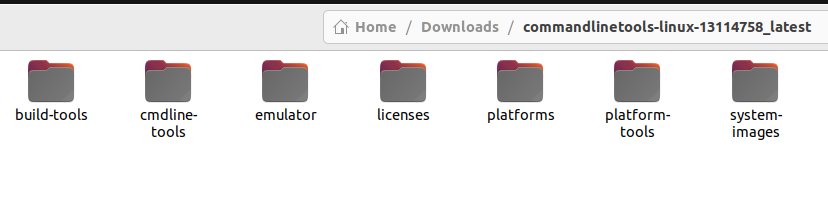

# SDL on Android

## Project Overview

This project demonstrates how to use **SDL (Simple DirectMedia Layer)** on the **Android operating system**.  

Typically, developers use build tools like **Gradle** or **CMake** to integrate SDL into Android projects.  
In this repository, however, the entire process is performed **manually**, which was an extremely educational experience for me.

The `build_libs.sh` script outlines all the steps required to build the project.  
It is highly recommended to review **all the files in this repository** to fully understand how the system works and how you can adapt it to your own projects. Here are some screenshots showing the project on emulator:
<div style="display: flex; gap: 10px;">

  
  
</div>

In the sections below, I will walk you through the process step by step.

## Section 1: Prerequisites

Before building the project, make sure you have the following tools installed.

### Android NDK

To build the **C and C++ source files** for Android, you will need the **Android NDK**.

In this project, I used **android-ndk-r27d-linux**.  

You can download the NDK from the official Android page:  
[https://developer.android.com/ndk/downloads](https://developer.android.com/ndk/downloads)

After downloading, **extract the archive** to a suitable location.  
We will be using the `ndk-build` tool from the NDK to compile the native C/C++ code.

### Android Command Line Tools

To manage Android SDK packages and emulators, you will need the **Android Command Line Tools**.  

You can download them from the official page:  
[https://developer.android.com/tools](https://developer.android.com/tools)  

In this project, I used **commandlinetools-linux-13114758_latest**.  
After downloading, **extract the archive** and explore the folder.  

The Command Line Tools include two main utilities:

- `sdkmanager`: used to install other SDK components.  
- `avdmanager`: used to create and manage Android Virtual Devices (emulators).  

---

#### Installing Required SDK Packages

Using `sdkmanager`, you should install the following components:

1. `build-tools`  
   - Contains essential tools like `aapt2` and `zipalign` to build the final APK.  

2. `emulator`  
   - Contains the `emulator` tool to run a virtual Android device and test your application.  

3. `platform-tools`  
   - Contains the `adb` tool, which is used to install and debug APKs on an emulator or real device.  

4. `platforms`  
   - Make sure to install **Android 33 or higher**.  
   - Note: The SDL3 Java code in this project did **not compile with Android 30** for me.

> 💡 Tip: You can easily explore the contents of all these folders to familiarize yourself with the tools.

---

#### Notes

- How to use `sdkmanager` to install these packages and create an emulator is straightforward.  
- You can find instructions online; you will likely not encounter any issues.  

---

Here is a visual overview of my `commandlinetools` folder:



### SDL3

To use SDL3 in this project, you will need to **compile its files using the NDK**.  
Therefore, you need to download the SDL3 library first.

You can download the release files from the official SDL website:  
[https://libsdl.org/release/](https://libsdl.org/release/)

In this project, I used **SDL3-3.4.0**.  
After downloading, **extract the archive** and explore its contents.  

> Note: Inside the SDL3 folder, you will find an `Android.mk` file, which allows you to build the library using the NDK (we will get to this later).  

Also, make sure to check the `android-project` folder inside SDL3.  
The **Java source files** of SDL3 are located here:

`SDL3-3.4.0/android-project/app/src/main/java/org/libsdl/app/`


That's a long path! You will need these files as well.  
In this project, I have placed them inside `android_build/java`, but you should always check the Java files of your own SDL3 version.

---

#### SDL HelloWorld Example

For this project, I used a simple **SDL_helloworld** project.  
You can get it from:  
[https://github.com/libsdl-org/SDL_helloworld](https://github.com/libsdl-org/SDL_helloworld)

- The **main.c** file is the original main program.  
  I have slightly modified it and placed it in `jni/main.cpp` in this project, so it works with both C and C++.

- In the SDL_helloworld project, under:

`SDL_helloworld/app/src/main`


you will need two items:  

1. `res/` folder  
2. `AndroidManifest.xml`  

I have placed these files inside the `android_build` folder in this project.

- Additionally, the following Java activity file is required:

`SDL_helloworld/app/src/main/java/org/libsdl/helloworld/HelloWorldActivity.java`


(Yes, the paths are long!)  
I have included this file in `android_build/java` in this project.

---

#### Summary

All the necessary SDL3 and SDL_helloworld files are included in this repository.  
However, it is important that you **understand where they come from** and how they relate to your own SDL3 setup.

## Section 2: Environment Variables Setup

At this point, **all required tools and source files have been collected**.  
From here on, you can follow the contents of the `build_libs.sh` script step by step.

To simplify working with the **Android NDK** and **Android SDK** tools, several
**environment variables** are defined at the beginning of this script.
This allows all required tools to be accessed directly from the command line
without repeatedly typing long paths.

Below is the relevant part of the `build_libs.sh` script:

```bash
# here are your sdk and ndk tools

# we will use ndk-build from this path
export PATH="$PATH:$HOME/Downloads/android-ndk-r27d-linux/android-ndk-r27d"

# this is your jni directory containing SDL and your main.c / main.cpp
export NDK_MODULE_PATH="$PWD/jni"

# this path is used for sdkmanager and avdmanager
export PATH="$PATH:$HOME/Downloads/commandlinetools-linux-13114758_latest/cmdline-tools/latest/bin"

# android api address; you may use different versions (30 or 33 for example)
# you must install this API level using sdkmanager
ANDROID_JAR="$HOME/Downloads/commandlinetools-linux-13114758_latest/platforms/android-33/android.jar"
# ANDROID_JAR="$HOME/Downloads/commandlinetools-linux-13114758_latest/platforms/android-30/android.jar"

# build-tools path; required for aapt, aapt2 and zipalign
export PATH="$PATH:$HOME/Downloads/commandlinetools-linux-13114758_latest/build-tools/33.0.2"

# platform-tools path; required for adb
export PATH="$PATH:$HOME/Downloads/commandlinetools-linux-13114758_latest/platform-tools"

# emulator path; used only to run an emulator (not required for building)
# export PATH="$PATH:$HOME/Downloads/commandlinetools-linux-13114758_latest/emulator"

echo "* Your PATH variable is set and ready."
```
---

#### Notes

- You must update all paths according to your own SDK and NDK installation locations.
- `NDK_MODULE_PATH` must point to the directory containing the SDL sources and your native application code.
- The selected Android API level (for example, 33) must already be installed using `sdkmanager`.
- After this step, all required Android and NDK tools will be globally available and the build process can continue smoothly.

## Section 3: Building C and C++ Code

In this step, the native **C and C++ source files** are built using the
`ndk-build` tool.

Both the project’s `main.cpp` file and the **SDL3 library** are compiled,
and their corresponding **`.so` shared libraries** are generated.

Building SDL3 may take some time, so please be patient.  
However, this process is only required **once**. On subsequent builds,
there is no need to rebuild SDL3 from scratch unless the source files change.

After the build process completes, the generated files are placed into
two directories:

- `obj/` — intermediate build files
- `libs/` — final shared libraries (`.so` files)

Only the **`libs/`** directory is required for the next steps.

Once the build is finished, the contents of the `libs/` directory are copied
into `android_build/lib/`, which will later be packaged into the final APK.

> ⚠️ **Important:**  
> Inside the APK, the directory **must be named `lib`**.  
> Android will not load native libraries from any other directory name.

The following commands from the `build_libs.sh` script perform the build
and copy operations:

```bash
# here are building stuff
echo "* Running ndk-build - .so files are in libs/"
ndk-build

# after building libs we have to build apk and add libs and other stuff.
# first we copy ./libs/ contents into ./android_build/lib
cp -r ./libs/* ./android_build/lib/
echo "* Library files are ready in android_build/lib/"
```
---

## Section 4: Building Java Files

In this step, the **Java source files** taken from the **SDL3 library** and the
**SDL HelloWorld example** are compiled.

The Java files are compiled using `javac`.  
The output of this stage is a set of **`.class` files**, which are stored in
the `android_build/classes/` directory.

After that, the **`d8`** tool is used to generate the final **`.dex`** file.
This file is placed in the `android_build/dex/` directory and will be
packaged directly into the final APK.

If you do **not modify the Java source files**, this step only needs to be
performed **once** and can be safely skipped in subsequent builds.

The following commands from the `build_libs.sh` script perform this process:

```bash
# after compiling .so files and copying them into lib,
# we have to build java files. these java files are in
# android-project in sdl3 release. copy them in ./android_build/java
# you also need HelloWorldActivity.java as your main entry point.
# we compile these files into .class files. then finally we compile them
# into classes.dex file. we will use this file in our .apk file as the main
# entry point. I couldn't compile using android-30 but android-33 was OK.
# you have to compile these java files just once.

# first we use javac to compile these files to .class files
javac -classpath "$ANDROID_JAR" \
      -d ./android_build/classes/ \
      ./android_build/java/*.java
echo "* Class files are ready from java files."

# now we build .dex file. this is the final output from java files
# mkdir -p android_build/dex
d8 --lib "$ANDROID_JAR" \
   --output ./android_build/dex \
   $(find ./android_build/classes -name "*.class")
echo "* Final .dex file is ready."
```
---

## Section 5: Compiling Resources (res)

In this step, the Android **resource files** located in the `res/` directory
are compiled using the **`aapt2`** tool.

The resource directory is taken from the SDL HelloWorld example and placed
inside `android_build/res/`.  
You are free to modify this directory and customize the resources for your
own project. There is nothing special about this step.

The output of this process is a compiled resource archive named
`compiled_res.zip`, which will be used in the final APK packaging step.

The following commands from the `build_libs.sh` script perform this operation:

```bash
# now we compile res folder using aapt2
aapt2 compile --dir ./android_build/res -o ./android_build/compiled_res.zip
echo "* Final res is compiled to compiled_res.zip."
```
---
