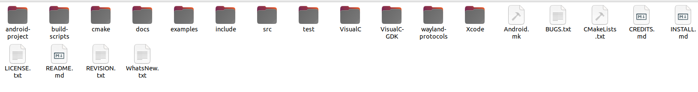

# SDL3

This folder contains the **release files / source code** of the **SDL3** library.

In this project, **SDL version 3.4.0** was used, but other SDL3 versions can also be used with minor adjustments.

## Steps

1. Download the SDL3 release (version 3.4.0).
2. Extract (unzip) the downloaded archive.
3. Copy all extracted files into this `SDL3/` directory.

## Build Output

The final shared libraries (`.so` files) will be built from these sources using the **Android NDK**.  
At this stage, there are no `.so` files yet — only the SDL source files are placed here.

## Folder Contents

The image below shows the expected structure and contents of this folder:

